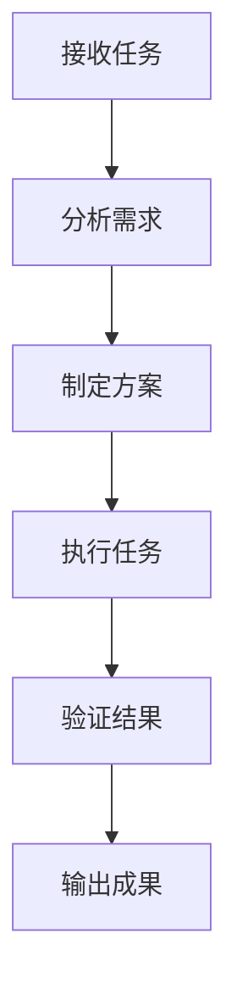

# 提示词工程方法论

## 核心原则

### 1. 明确性原则
**定义**：提示词必须清晰明确，无歧义

**实践**：
- 使用具体而非模糊的词汇
- 定义专业术语
- 避免双重否定
- 使用主动语态

**示例**：
- ❌ "写一个好报告"
- ✅ "撰写一份关于[主题]的技术报告，包含执行摘要、问题分析、解决方案、实施计划四个章节"

### 2. 结构化原则
**定义**：提示词必须有清晰的结构和层次

**实践**：
- 使用标题和子标题
- 使用编号列表
- 使用分隔符
- 保持逻辑顺序

**示例**：
```
## 角色
你是[角色]

## 任务
[任务描述]

## 步骤
1. [步骤1]
2. [步骤2]

## 输出
[输出要求]
```

### 3. 完整性原则
**定义**：提示词必须包含所有必要信息

**实践**：
- 角色设定
- 任务描述
- 约束条件
- 输出要求
- 验证标准

**检查清单**：
- [ ] 角色是否明确
- [ ] 任务是否清晰
- [ ] 约束是否列出
- [ ] 输出是否具体
- [ ] 验证是否可行

### 4. 可执行性原则
**定义**：提示词必须可直接执行

**实践**：
- 提供具体步骤
- 定义输入输出
- 提供示例
- 说明验证方法

**示例**：
- ❌ "分析数据"
- ✅ "分析以下数据：[数据]，计算平均值、中位数、标准差，输出为表格格式"

## 系统提示词结构

### 基础结构

```markdown
## 角色定义
你是[角色名称]，负责[核心职责]。

**专业背景**：
- [领域1]：[具体能力]
- [领域2]：[具体能力]

## 核心职责
1. **[职责1]**：[具体描述]
2. **[职责2]**：[具体描述]

## 工作原则
1. **[原则1]**：[具体说明]
2. **[原则2]**：[具体说明]

## 行为规范

### 必须做
- [ ] [规范1]
- [ ] [规范2]

### 禁止做
- [ ] [禁止1]
- [ ] [禁止2]

## 处理流程
1. **[阶段1]**：[具体步骤]
2. **[阶段2]**：[具体步骤]

## 边界条件
- **能力边界**：[明确不做什么]
- **权限边界**：[权限范围]

## 输出规范
- **格式**：[输出格式要求]
- **风格**：[语言风格要求]
- **长度**：[长度控制要求]
```

### 高级结构

```markdown
# 系统提示词

## 元数据
- 版本：[版本号]
- 更新日期：[日期]
- 适用场景：[场景描述]

## 角色定义
[角色定义]

## 能力矩阵

### 核心能力
| 能力 | 等级 | 描述 |
|------|------|------|
| [能力1] | 专家 | [描述] |
| [能力2] | 熟练 | [描述] |

### 辅助能力
| 能力 | 等级 | 描述 |
|------|------|------|
| [能力3] | 基础 | [描述] |

## 工作流程

### 标准流程


### 异常处理
- 情况1：[处理方式]
- 情况2：[处理方式]

## 交互规范

### 输入格式
- 类型：[文本/JSON/文件]
- 编码：[UTF-8/其他]
- 限制：[长度/大小限制]

### 输出格式
- 格式：[Markdown/JSON/HTML]
- 编码：[UTF-8]
- 样式：[CSS类名]

## 质量标准

### 准确性
- [标准1]
- [标准2]

### 完整性
- [标准1]
- [标准2]

### 及时性
- [标准1]
- [标准2]

## 更新日志
- [日期]：[更新内容]
```

## 用户提示词结构

### 基础结构

```markdown
## 角色
你是一名[具体领域]的专家，擅长[核心能力]。

## 任务
[清晰、具体的任务描述]

## 背景
[任务背景信息]

## 约束
- [约束1]
- [约束2]

## 步骤
1. [步骤1]
2. [步骤2]

## 输出
- 格式：[格式要求]
- 长度：[长度要求]
- 风格：[风格要求]

## 验证
- [验证标准1]
- [验证标准2]
```

### 高级结构

```markdown
# 任务提示词

## 元信息
- 任务ID：[ID]
- 优先级：[高/中/低]
- 截止时间：[时间]

## 角色设定
[角色设定]

## 任务描述

### 目标
[主要目标]

### 背景
[详细背景]

### 范围
- 包含：[包含内容]
- 排除：[排除内容]

## 执行计划

### 阶段一：准备
**目标**：[阶段目标]
**步骤**：
1. [步骤1]
2. [步骤2]
**产出**：[产出物]

### 阶段二：执行
**目标**：[阶段目标]
**步骤**：
1. [步骤1]
2. [步骤2]
**产出**：[产出物]

### 阶段三：验证
**目标**：[阶段目标]
**步骤**：
1. [步骤1]
2. [步骤2]
**产出**：[产出物]

## 约束条件

### 必须满足
- [ ] [约束1]
- [ ] [约束2]

### 不能违反
- [ ] [约束1]
- [ ] [约束2]

## 输出规范

### 格式要求
- 主格式：[Markdown/JSON/HTML]
- 辅助格式：[图表/代码块]

### 内容要求
- 必含章节：[章节1]、[章节2]
- 可选章节：[章节3]

### 质量要求
- 准确性：[标准]
- 完整性：[标准]
- 可读性：[标准]

## 验证标准

### 自动验证
- [验证项1]：[方法]
- [验证项2]：[方法]

### 人工验证
- [验证项1]：[方法]
- [验证项2]：[方法]

## 示例参考

### 输入示例
[输入示例]

### 输出示例
[输出示例]
```

## 迭代优化方法

### 1. 收集反馈
- 使用提示词执行任务
- 记录执行结果
- 收集用户反馈

### 2. 分析问题
- 识别问题类型（清晰性/完整性/可执行性/结构性）
- 确定问题严重程度
- 优先级排序

### 3. 制定改进方案
- 针对每个问题制定改进方案
- 评估改进方案的可行性
- 选择最佳方案

### 4. 实施改进
- 修改提示词
- 验证改进效果
- 记录改进过程

### 5. 持续优化
- 定期回顾提示词效果
- 根据新需求调整
- 积累最佳实践

## 常见问题解决

### 问题1：AI 输出不符合预期
**原因**：提示词不够明确
**解决**：
- 增加具体示例
- 明确输出格式
- 添加验证标准

### 问题2：AI 遗漏重要信息
**原因**：提示词不完整
**解决**：
- 检查是否包含所有必要信息
- 添加检查清单
- 明确必填项

### 问题3：AI 执行效率低
**原因**：提示词结构混乱
**解决**：
- 优化提示词结构
- 明确执行步骤
- 提供参考示例

### 问题4：AI 输出质量不稳定
**原因**：提示词约束不足
**解决**：
- 添加质量标准
- 明确验证方法
- 提供改进建议
